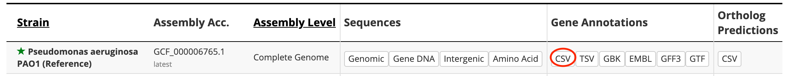
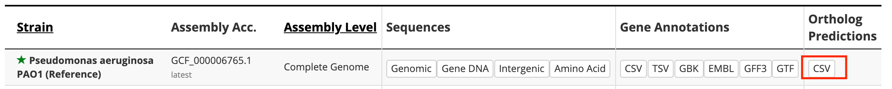

This directory includes data files that are used to populate the database
during deployment.

1. **Pseudomonas_aeruginosa_PAO1.gene_info**: PAO1 genes of `Pseudomonas` organism.

   This file is decompressed from **raw/Pseudomonas_aeruginosa_PAO1.gene_info.gz**, which
is downloaded from:
`ftp://ftp.ncbi.nih.gov/gene/DATA/GENE_INFO/Archaea_Bacteria/Pseudomonas_aeruginosa_PAO1.gene_info.gz`

2. **gene_history_208964**: gene history file of organism whose taxonomy ID is 208964.

   This file is generated based on the following procedure:
   ```shell
   wget ftp://ftp.ncbi.nih.gov/gene/DATA/gene_history.gz
   gunzip -k gene_history.gz
   (head -1 gene_history; grep "^208964\t" gene_history) > gene_history_208964
   ```
   The original downloaded file **gene_history.gz** is saved in **raw** subdirectory as
   a referenece.

3. **updated_genes.tsv**: maps a gene's PAO1 name to its standard name and aliases.

   This file is the output of the following commands:
   ```shell
   cd raw/; python3 create_updated_genes.py
   ```

4. **Pseudomonas_aeruginosa_genesets.json**: public genesets of pseudomonas

   This JSON file should be converted to Python pickle format by `deployment/create_pickled_genesets.py`.
   The pickle file is required by the endpoint of
   `/api/v1/tribe_client/return_unpickled_genesets?organism=Pseudomonas+aeruginosa`

5. **raw/Pseudomonas_aeruginosa_PAO1_107.csv**: Pseudomonas gene annotations file

   This file was decompressed from
http://pseudomonas.com/downloads/pseudomonas/pgd_r_19_1/Pseudomonas_aeruginosa_UCBPP-PA14_109/Pseudomonas_aeruginosa_UCBPP-PA14_109.csv.gz, with line `4628` commented out:
   ```
   19.1,GCF_000006765.1,chromosome,NC_002516.2,PGD111894,PA4527,pseudo,5071567,5072691,+,still frameshift type 4 fimbrial biogenesis protein PilC (putative pseudogene),,,,,,1125,,,,
   ```
   because the gene `PA4527` is already available on line `4627`.

   The download URL is copied from
   [Pseudomonas Downlaod Page](http://pseudomonas.com/strain/download).
   See the red link on the following screenshot:
   <div align="center">
       
   </div>

   This file is used to map a gene's PAO1 name to its standard name and aliases (if any).

6. **raw/Pseudomonas_aeruginosa_PAO1_107_orthologs.csv**: Pseudomonas ortholog predictions file

   This file is decompressed from:
   http://pseudomonas.com/downloads/pseudomonas/pgd_r_19_1/Pseudomonas_aeruginosa_PAO1_107/Pseudomonas_aeruginosa_PAO1_107_orthologs.csv.gz

   The download URL is copied from
   [Pseudomonas Downlaod Page](http://pseudomonas.com/strain/download).
   See the red link on the following screenshot:
   <div align="center">
       
   </div>

   This file is used to map a gene's PAO1 name to its PA14 name.

7. **raw/gene_name_alias_corrections.tsv**: a TSV file with gene gene names/alaises corrections

   This file was generated by Dongbo Hu, Georgia Doing and Deb Hogan.

8. **raw/create_updated_genes.py**: a script that reads files **4**, **5**, **6**, and
prints out the updated gene names and aliases.

   The output is used as the input of the management command
   `genes/management/commands/update_gene_names_aliases.py`.
