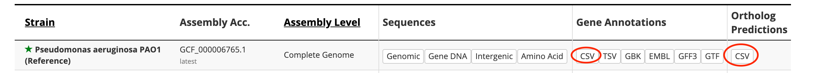

This directory includes data files that are used to populate the database
during deployment.

1. **Pseudomonas_aeruginosa_PAO1.gene_info**: PAO1 genes of `Pseudomonas` organism.
-----------------------------------------------------------------------------------
This file is decompressed from raw//Pseudomonas_aeruginosa_PAO1.gene_info.gz,
which is downloaded from:
ftp://ftp.ncbi.nih.gov/gene/DATA/GENE_INFO/Archaea_Bacteria/Pseudomonas_aeruginosa_PAO1.gene_info.gz

2. **gene_history_208964**: gene history file of organism whose taxonomy ID is 208964.
--------------------------------------------------------------------------------------

This file is generated based on the following procedure:
```shell
wget ftp://ftp.ncbi.nih.gov/gene/DATA/gene_history.gz
gunzip -k gene_history.gz
(head -1 gene_history; grep "^208964\t" gene_history) > gene_history_208964
```
The downloaded `gene_history.gz` is saved in `raw` subdirectory as a referenece.

3. **pao1_to_pa14.tsv**: maps a gene's PAO1 name to its PA14 names.
-----------------------------------------------------------------------------------

This file is generated by the following procedures:
```shell
wget http://pseudomonas.com/downloads/pseudomonas/pgd_r_19_1/Pseudomonas_aeruginosa_PAO1_107/Pseudomonas_aeruginosa_PAO1_107_orthologs.csv.gz
(zcat Pseudomonas_aeruginosa_PAO1_107_orthologs.csv.gz | awk -F'","' '{if ($4 == "Pseudomonas aeruginosa UCBPP-PA14") print $2"\t"$5}') > pao1_to_pa14.tsv
```
The URL is referred by the `CSV` button of `Ortholog Predictions` column in the table on
`http://pseudomonas.com/strain/download` page. See the screenshot:
<div align="center">
    
</div>

The downloaded `Pseudomonas_aeruginosa_PAO1_107_orthologs.csv.gz` is saved in `raw` subdirectory
as a reference.
